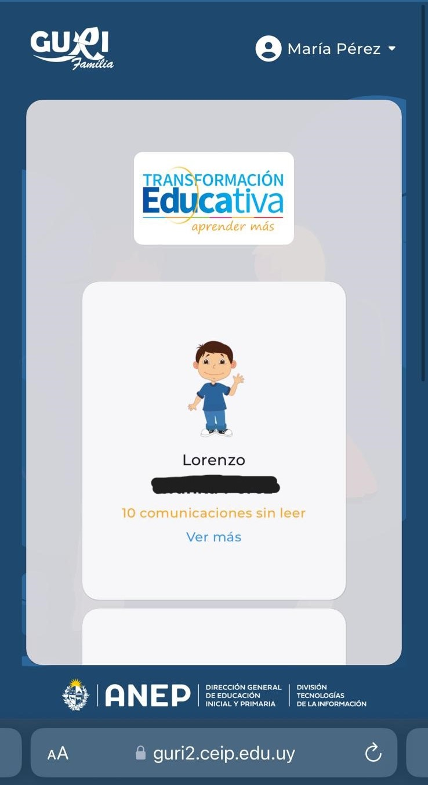
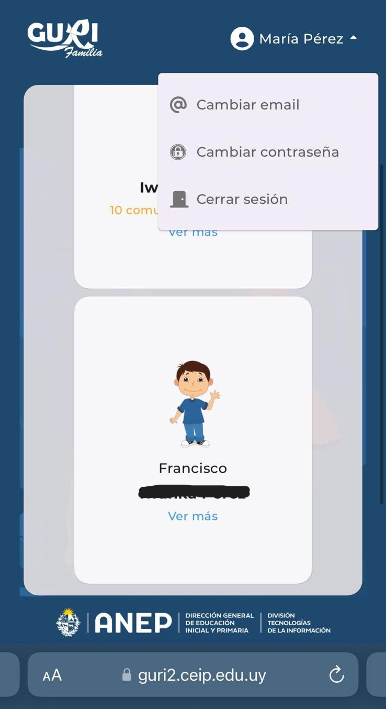
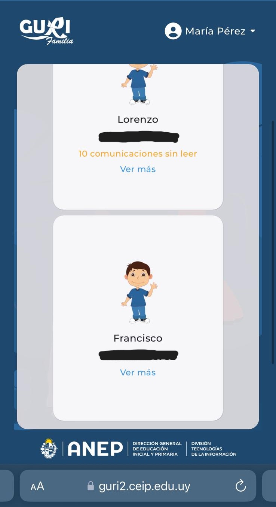
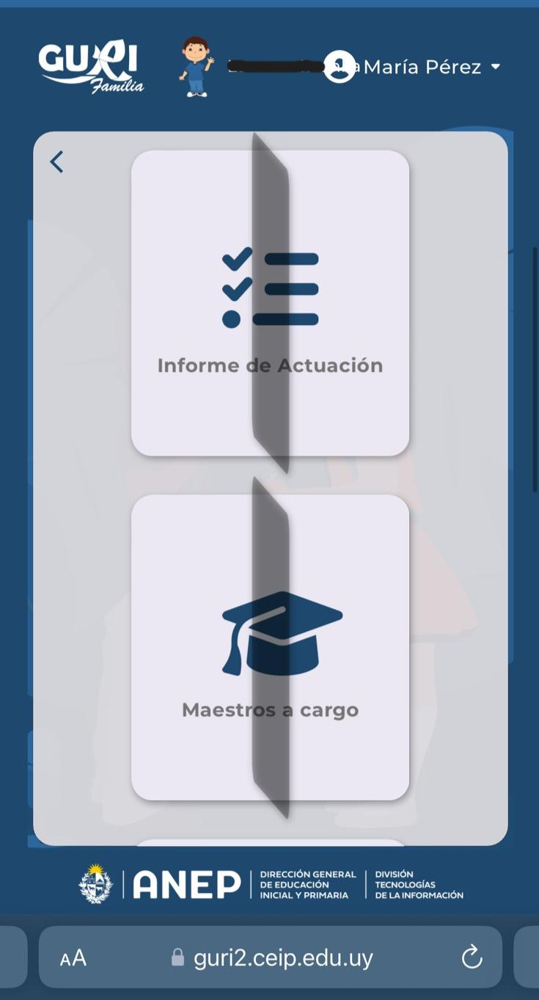
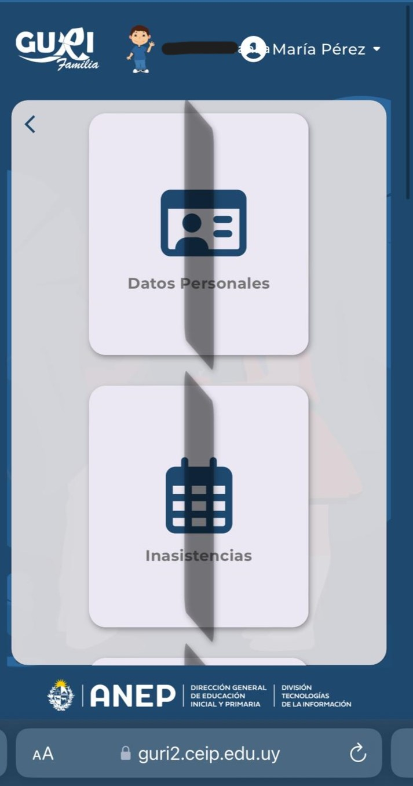
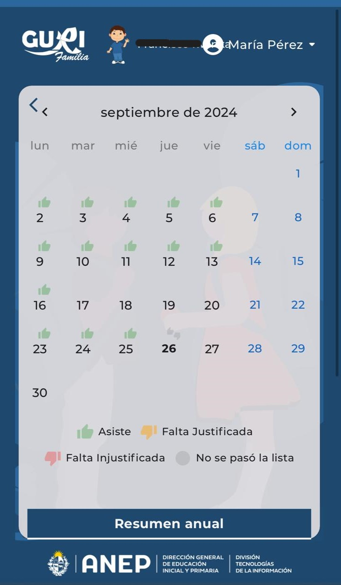
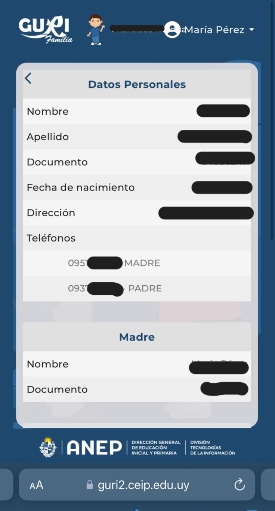
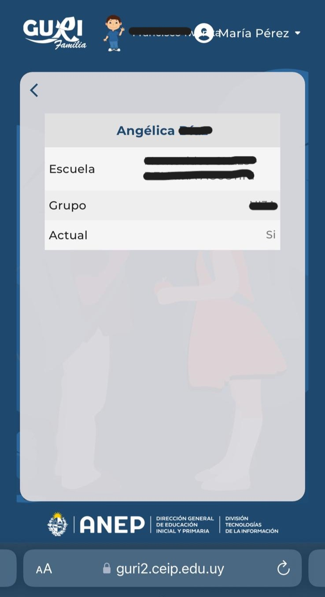
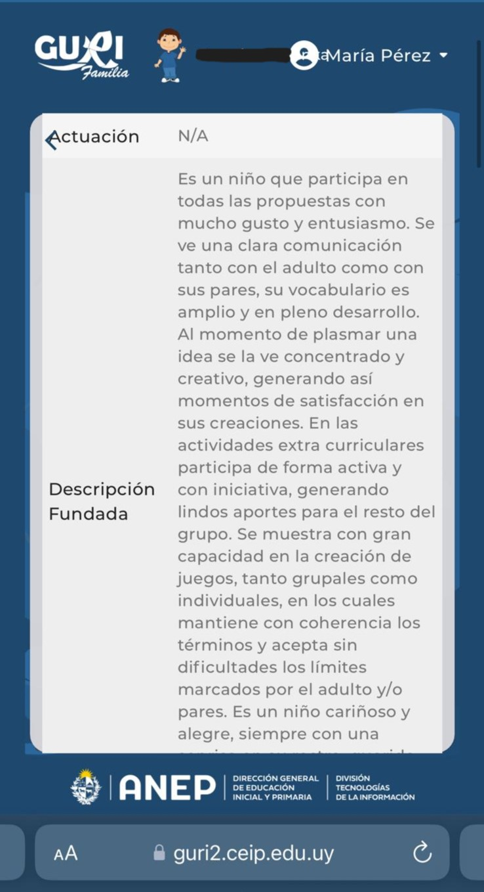

# Relevamiento de herramientas del mercado.

## "GURI" (Local)

- [Pagina web](https://guri2.ceip.edu.uy/GuriFamiliaAppWeb/)
- Usuario Padres de alumno

## Imagenes del sistema

##   

##   

##   

### Requerimientos Funcionales.

- Modificaciones en campos. - Mod.1
  El sistema permite cambiar el correo electrónico del usuario. - Mod.2
  El sistema permite cambiar la contraseña de acceso.

- Actuacion. - Act.1
  El sistema tiene un sector para cada niño en el caso de que tenga mas de un hijo. - Act.2
  El sistema tiene un informe con detalles sobre la actuación del alumno, visible para los padres o tutores..

- Inasistenacias. - Ina.1
  El sistema tiene un sector de inasistencias para los alumnos. - Ina.2
  El sistema marca las inasistencias y asistencias en un calendario con colores que indican si asistió (verde), faltó (rojo), justificó la falta (amarillo), o si no se pasó lista (gris).

- Datos Personales. - DatosP.1
  Tiene un sector para datos personales. - DatosP.2
  En datos personales tiene los datos personales del alumno y padres.

- Maestros a cargo. - MaestrosaC.1
  Tiene un sector de maestro a cargo. - MaestrosaC.2
  En el sector maestros a cargo muestra el nombre, escuela y el grupo.

### Requerimientos no funcionales.

- El sistema no permite la creación de cuentas sin autorización de ANEP.

- Los datos personales de alumnos y padres no son visibles para otros usuarios no autorizados.

- El sistema es fácil de usar, con una interfaz intuitiva.

- El sistema está operativo la mayor parte del tiempo, con mínimas interrupciones.

## Conclusion

GURI no cubre la necesidad específica de planificación semanal de las maestras en relación con los programas de ANEP. Aunque es una excelente herramienta para la gestión de datos y rendimiento académico, no ofrece un sistema dedicado a la gestión curricular en detalle.
