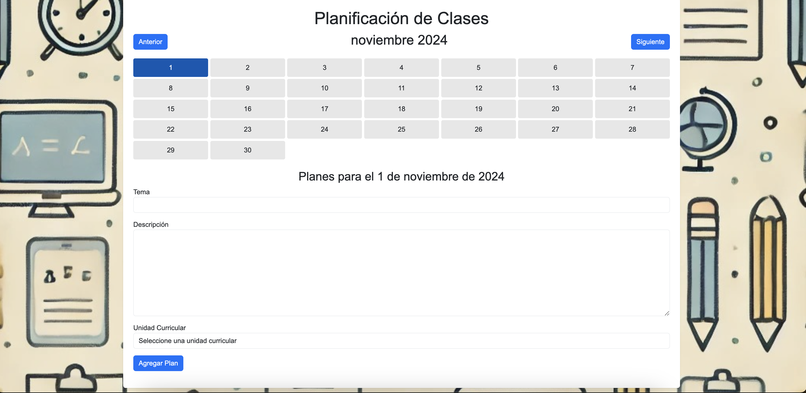
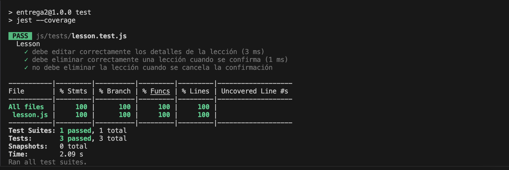

# Informe académico (entrega 2)

## Construcción

### Implementación de funciones principales

### Alcance establecido

- **UsuMaestra1:** El sistema debe permitir a los usuarios maestra crear los planes de clase. Prioridad (""Alta"")
- **UsuMaestra2:** El sistema debe permitir a los usuarios maestra editar los planes de clase. Prioridad (""Alta"")
- **UsuMaestra3:** El sistema debe permitir a los usuarios maestra eliminar los planes de clase. Prioridad (""Alta"")
- **UsuMaestra4:** El sistema debe permitir a los usuarios maestra vincular una clase a las unidades curriculares correspondientes de ANEP. Prioridad (""Alta"")
- **UsuMaestra5:** El sistema debe permitir a los usuarios maestra agregar a un calendario los planes de clase. Prioridad (""Alta"")
- **UsuMaestra7:** El sistema debe permitir a las maestras asignar unidades curriculares personalizadas para cada alumno. Prioridad (""Media"")

### Librerías externas

- **jest:** Framework de pruebas para JavaScript, utilizado para realizar pruebas unitarias y generar cobertura de código.

- **eslint:** Herramienta para analizar el código en busca de errores de estilo y calidad, asegurando que el código siga las buenas prácticas.

- **prettier:** Herramienta de formateo automático de código para mantener el estilo consistente en todo el proyecto.

- **babel-jest:** Transpila código JavaScript usando Babel en un entorno de pruebas de Jest, permitiendo el uso de la sintaxis más reciente de JavaScript.

## Interfaz de usuario

### Buenas prácticas

Las buenas practicas en la UI ayudan a crear una interfaz que sea intuitiva, clara y fácil de usar.
En el proyecto aplicamos las siguientes:

- **Visibilidad:** Los botones de navegación ("Anterior" y "Siguiente") están claramente visibles en la interfaz. El día seleccionado (el 1 de noviembre) está resaltado en azul, lo que facilita que el usuario vea qué día está seleccionado. El formulario de planificación también está bien visible, y el texto se encuentra en un lugar accesible.

- **Feedback:** El sistema proporciona feedback al usuario al resaltar el día seleccionado en el calendario. También, muestra información dinámica en función al dia seleccionado por usuario, lo que indica que el sistema ha respondido correctamente a la interacción.

- **Consistencia:** Los botones y campos de texto tienen un estilo consistente, con colores claros y tipografía homogénea. Los botones de navegación y el formulario tienen una apariencia coherente, lo que facilita el aprendizaje del diseño y la interacción con la interfaz.

- **Affordance (Percepción de uso):** Los botones como "Anterior", "Siguiente", y "Agregar Plan" tienen un diseño que sugiere que son interactivos. El usuario entiende intuitivamente que los botones pueden ser presionados. Además, el campo de texto para ingresar la descripción tiene una caja de texto visible, lo que sugiere que el usuario puede escribir en ella.

- **Mapeo:** El mapeo entre el calendario y los formularios de planificación es intuitivo. Al seleccionar un día del calendario, la interfaz ajusta los campos debajo del calendario para reflejar la fecha seleccionada. Esto hace que el usuario pueda asociar rápidamente un día con los campos de entrada de "Tema", "Descripción" y "Unidad Curricular".

### Usabilidad

Usamos las heurísticas de usabilidad de Jakob Nielsen para diseñar y desarrollar nuestro proyecto. Estas heurísticas nos ayudaron a crear una interfaz fácil de usar, asegurándonos de que el sistema sea claro, eficiente e intuitivo, para que los usuarios puedan navegar sin complicaciones.

**Heuristicas Jakob Nielsen:**

- **Visibilidad del estado del sistema:** El sistema debe mantener a los usuarios informados sobre lo que está sucediendo a través de retroalimentación apropiada en un tiempo razonable.

  - **Aplicación:** En la ventana emergente de "Editar Plan de Clase", el sistema mantiene informado al usuario sobre la acción actual (editar un plan) con un título claro y los campos precargados con la información. La notificación de confirmación cuando se intenta eliminar un plan también informa al usuario sobre la acción que está por tomar.

- **Relación entre el sistema y el mundo real:** El sistema debe hablar el idioma de los usuarios, utilizando palabras, frases y conceptos familiares, en lugar de terminología técnica.

  - **Aplicación:** El sistema utiliza términos familiares para el usuario, como "Tema", "Descripción", "Unidad Curricular", y botones como "Editar", "Eliminar" y "Actualizar Plan". Estos términos son sencillos y comprensibles, lo que facilita la interacción del usuario con el sistema.

- **Control y libertad del usuario:** Los usuarios a menudo eligen funciones por error y necesitarán una manera fácil de deshacer y rehacer acciones.

  - **Aplicación:** El usuario tiene la posibilidad de cancelar la acción de eliminación de un plan gracias a la confirmación de la ventana emergente, lo que le otorga control sobre la acción. Además, en el caso de la edición de planes, el usuario puede hacer cambios y luego actualizarlos, dándole libertad para corregir cualquier error.

- **Consistencia y estándares:** Los usuarios no deben tener que preguntarse si diferentes palabras, situaciones o acciones significan lo mismo. Se deben seguir las convenciones de la plataforma.

  - **Aplicación:** El diseño y los botones (como "Editar", "Eliminar" y "Actualizar Plan") siguen un formato consistente en toda la aplicación. Los colores y la tipografía también se mantienen constantes, lo que facilita el aprendizaje y uso del sistema.

- **Prevención de errores:** Es mejor diseñar el sistema de manera que prevenga problemas antes de que ocurran, en lugar de tener que mostrar mensajes de error.

  - **Aplicación:** El sistema previene errores al confirmar la acción de eliminar un plan con un mensaje de advertencia que solicita confirmación. Esto asegura que los usuarios no eliminen accidentalmente información importante.

- **Reconocimiento en lugar de recuerdo:** Minimizar la carga de memoria del usuario haciendo que los objetos, acciones y opciones sean visibles. La información no debe depender de que el usuario la recuerde.

  - **Aplicación:** Los campos del formulario (Tema, Descripción, Unidad Curricular) están visibles y etiquetados claramente, lo que permite a los usuarios reconocer fácilmente qué deben llenar sin tener que recordar información de otras partes de la interfaz.

- **Estética y diseño minimalista:** Las interfaces no deben contener información irrelevante o rara vez necesaria. Cada unidad de información adicional en una pantalla compite con las unidades relevantes de información y reduce su visibilidad.

  - **Aplicación:** El diseño es limpio y simple, con los elementos esenciales (calendario, formulario de planificación y botones de acción) bien distribuidos. No hay elementos innecesarios que distraigan al usuario de la tarea principal, que es agregar o editar un plan.

- **Ayuda y documentación:** Aunque es mejor si el sistema se puede usar sin documentación, puede ser necesario proporcionar ayuda y documentación. Esta información debe ser fácil de buscar, centrarse en la tarea del usuario y listar los pasos concretos a seguir.

  - **Aplicación:** La simpleza de los elementos y su disposición hace que el sistema sea fácil de usar sin necesidad de documentación adicional. Los términos utilizados son claros y el flujo es intuitivo.

### Accesibilidad

captura de wave, texto introductorio

## Codificación

clases del domi, con mas introduccion

### Clases del Dominio

- **Clase Calendar:** la diseñamos para gestionar todo lo relacionado con el calendario. Su función principal es generar los días del mes, actualizar el calendario cuando seleccionamos un día y reflejar esos cambios en la interfaz de usuario. La ventaja de tener esta lógica dentro de una clase es que centraliza el manejo del calendario en un solo lugar, evitando que tengamos que repetir código en distintas partes de la aplicación. Además, al pasarle un renderCallback, podemos agregar funcionalidad extra cada vez que seleccionamos un día, como cargar las lecciones correspondientes. Esto le otorga flexibilidad y nos facilita adaptarla a nuevas necesidades. Así, si necesitamos modificar o ampliar el calendario en el futuro, podemos hacerlo sin complicaciones.

- **Clase Lesson:** la creamos con el fin de organizar las lecciones de manera estructurada. Cada lección tiene propiedades definidas, como el tema, la descripción, la unidad curricular y un identificador único (id). Esto facilita el manejo de las lecciones y nos permite acceder a ellas de manera ordenada. Además, dentro de la clase tenemos métodos como editLesson y deleteLesson que nos permiten modificar o eliminar lecciones sin necesidad de modificar los datos directamente. Esto nos ayuda a mantener el código limpio y organizado, y a evitar duplicación de lógica en otras partes de la aplicación. Si en el futuro necesitamos agregar nuevas funcionalidades a las lecciones, podemos hacerlo sin afectar el resto del sistema.

- **Clase System:**

  - # Terminar cuando este

- **Archivo main.js:** actúa como el punto central que integra todas las partes del sistema. Es el encargado de gestionar los eventos de la interfaz de usuario: la selección de días en el calendario, la adición y edición de lecciones, y la carga de datos externos, como las unidades curriculares. Este archivo se encarga de hacer que las clases Calendar y Lesson se comuniquen con la UI de manera eficiente, sin que estén directamente acopladas entre sí. Si no tuviéramos este archivo, el código se dispersaría y sería difícil de mantener. Gracias a main.js, podemos manejar todos los eventos y actualizaciones de la interfaz de forma organizada y asegurarnos de que cada acción se ejecute correctamente.

### Estándares de codificación y Análisis estático de código

#### Estandares de ESLint (análisis de calidad del código)

- **Advertencia por variables no utilizadas:** Genera una advertencia cuando se definen variables que no se usan en el código.

- **Advertencia por variables no definidas:** Genera una advertencia cuando se hace referencia a variables no definidas en el código.

- **Punto y coma al final de las declaraciones:** Exige que todas las declaraciones terminen con un punto y coma.

- **Comillas simples en lugar de comillas dobles:** Exige que se usen comillas simples para las cadenas de texto, en lugar de comillas dobles.

- **Uso de llaves en todas las estructuras de control:** Exige que todas las estructuras de control (como if, for, etc.) usen llaves, incluso si tienen solo una línea.

- **Indentación de 2 espacios:** Exige una indentación de 2 espacios para el código, evitando el uso de tabulaciones o más espacios.

- **Advertencia por números mágicos:** Genera una advertencia si se usan números "mágicos" (números sin un significado claro), exceptuando los números 0, 1 y 2.

- **Uso de const en lugar de let:** Exige que se use const para las variables que no se reasignan, para mayor claridad.

- **Valor de retorno consistente en funciones:** Exige que las funciones tengan un valor de retorno consistente (o siempre devuelvan algo, o nunca lo hagan).

- **Prohibición de espacios al final de las líneas:** Genera un error si hay espacios innecesarios al final de una línea.

- **Uso de notación camelCase:** Exige que las variables y funciones se escriban en notación camelCase (la primera palabra en minúsculas y las siguientes con mayúsculas).

- **Prohibición del uso de var:** Prohíbe el uso de var para declarar variables, en favor de let o const.

#### Estandares de Prettier (formateo de código)

- **Punto y coma al final de las declaraciones:** Exige que se usen puntos y coma al final de cada declaración.

- **Comillas simples en lugar de comillas dobles:** Exige que se utilicen comillas simples en las cadenas de texto, en lugar de comillas dobles.

- **Comas finales en objetos y arrays:** Exige que se pongan comas al final de los elementos en objetos y arrays.

- **Paréntesis alrededor de los parámetros de funciones flecha:** Exige que las funciones flecha tengan paréntesis alrededor de sus parámetros, incluso si solo tienen uno.

#### Estandares generales (convenciones de nomenclatura y estilo)

- **Código en inglés:** Se debe escribir todo el código en inglés para garantizar la comprensión global y facilitar la colaboración.

- **Funciones, variables y constantes en JavaScript:** Las funciones, variables y constantes deben escribirse en camelCase. Esto significa que la primera palabra debe estar en minúscula y, en caso de que haya más de una palabra, la primera letra de la siguiente palabra debe ir en mayúscula

- **Nombre de IDs y clases HTML:** Las palabras deben separarse por guiones medios (-), y todo debe estar en minúscula

### Buenas prácticas de OOP

separar interfaz, explicarlo

## Test unitario

### Buenas prácticas

1. **Independencia de las pruebas:** Cada prueba se ejecuta en un entorno limpio gracias a beforeEach, lo que garantiza que no dependen del orden de ejecución y pueden correr en cualquier orden.

2. **Enfoque en un solo objetivo:** Las pruebas se centran en un único objetivo claro, lo que facilita su comprensión y mantenimiento.

3. **Mantenimiento adecuado:** La estructura modular de las pruebas y el uso de beforeEach facilita su actualización cuando se realizan cambios en la implementación del código.

4. **Cobertura adecuada de pruebas:** Se cubren tanto los flujos de éxito como los de error (confirmación y cancelación de eliminación), asegurando que todos los comportamientos importantes sean verificados.

5. **Pruebas simples y claras:** Las pruebas son fáciles de leer, sin lógica innecesaria ni estructuras complejas, lo que mejora la legibilidad y comprensión.

6. **Verificaciones consistentes:** Cada prueba realiza verificaciones claras utilizando expect, asegurando que las pruebas validen el comportamiento del código.

7. **Modularidad y reutilización:** El uso de beforeEach permite que las configuraciones comunes se reutilicen fácilmente, manteniendo las pruebas organizadas.

8. **Claridad en los flujos de prueba:** Cada flujo de trabajo importante (como la edición y eliminación de lecciones) se valida de forma explícita, lo que facilita la identificación de fallos.

### Informe de cobertura

## Reflexión

### Detalle del trabajo individual

Detallar: fecha, actividad, horas, responsable
Incluir totales de esfuerzo

### Técnicas aplicadas y aprendizajes
