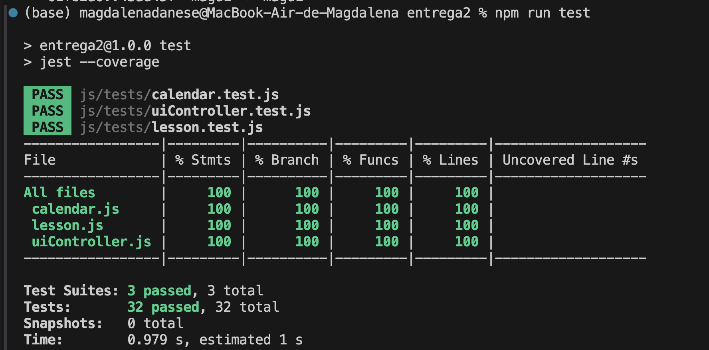

# Informe académico (entrega 2)

## Construcción

### Implementación de funciones principales

### Librerías externas

- **jest:** Framework de pruebas para JavaScript, utilizado para realizar pruebas unitarias y generar cobertura de código.

- **eslint:** Herramienta para analizar el código en busca de errores de estilo y calidad, asegurando que el código siga las buenas prácticas.

- **prettier:** Herramienta de formateo automático de código para mantener el estilo consistente en todo el proyecto.

- **babel-jest:** Transpila código JavaScript usando Babel en un entorno de pruebas de Jest, permitiendo el uso de la sintaxis más reciente de JavaScript.

## Interfaz de usuario

### Buenas prácticas

Las buenas practicas en la UI ayudan a crear una interfaz que sea intuitiva, clara y fácil de usar.
En el proyecto aplicamos las siguientes:

- **Visibilidad:** Los botones de navegación ("Anterior" y "Siguiente") están claramente visibles en la interfaz. El día seleccionado (el 1 de noviembre) está resaltado en azul, lo que facilita que el usuario vea qué día está seleccionado. El formulario de planificación también está bien visible, y el texto se encuentra en un lugar accesible.

- **Feedback:** El sistema proporciona feedback al usuario al resaltar el día seleccionado en el calendario. También, muestra información dinámica en función al dia seleccionado por usuario, lo que indica que el sistema ha respondido correctamente a la interacción.

- **Consistencia:** Los botones y campos de texto tienen un estilo consistente, con colores claros y tipografía homogénea. Los botones de navegación y el formulario tienen una apariencia coherente, lo que facilita el aprendizaje del diseño y la interacción con la interfaz.

- **Affordance (Percepción de uso):** Los botones como "Anterior", "Siguiente", y "Agregar Plan" tienen un diseño que sugiere que son interactivos. El usuario entiende intuitivamente que los botones pueden ser presionados. Además, el campo de texto para ingresar la descripción tiene una caja de texto visible, lo que sugiere que el usuario puede escribir en ella.

- **Mapeo:** El mapeo entre el calendario y los formularios de planificación es intuitivo. Al seleccionar un día del calendario, la interfaz ajusta los campos debajo del calendario para reflejar la fecha seleccionada. Esto hace que el usuario pueda asociar rápidamente un día con los campos de entrada de "Tema", "Descripción" y "Unidad Curricular".

### Usabilidad

Usamos las heurísticas de usabilidad de Jakob Nielsen para diseñar y desarrollar nuestro proyecto. Estas heurísticas nos ayudaron a crear una interfaz fácil de usar, asegurándonos de que el sistema sea claro, eficiente e intuitivo, para que los usuarios puedan navegar sin complicaciones.

**Heuristicas Jakob Nielsen:**

- **Visibilidad del estado del sistema:** El sistema debe mantener a los usuarios informados sobre lo que está sucediendo a través de retroalimentación apropiada en un tiempo razonable.
    - **Aplicación:** En la ventana emergente de "Editar Plan de Clase", el sistema mantiene informado al usuario sobre la acción actual (editar un plan) con un título claro y los campos precargados con la información. La notificación de confirmación cuando se intenta eliminar un plan también informa al usuario sobre la acción que está por tomar.

- **Relación entre el sistema y el mundo real:** El sistema debe hablar el idioma de los usuarios, utilizando palabras, frases y conceptos familiares, en lugar de terminología técnica.
    - **Aplicación:** El sistema utiliza términos familiares para el usuario, como "Tema", "Descripción", "Unidad Curricular", y botones como "Editar", "Eliminar" y "Actualizar Plan". Estos términos son sencillos y comprensibles, lo que facilita la interacción del usuario con el sistema.

- **Control y libertad del usuario:** Los usuarios a menudo eligen funciones por error y necesitarán una manera fácil de deshacer y rehacer acciones.
    - **Aplicación:** El usuario tiene la posibilidad de cancelar la acción de eliminación de un plan gracias a la confirmación de la ventana emergente, lo que le otorga control sobre la acción. Además, en el caso de la edición de planes, el usuario puede hacer cambios y luego actualizarlos, dándole libertad para corregir cualquier error.

- **Consistencia y estándares:** Los usuarios no deben tener que preguntarse si diferentes palabras, situaciones o acciones significan lo mismo. Se deben seguir las convenciones de la plataforma.
    - **Aplicación:** El diseño y los botones (como "Editar", "Eliminar" y "Actualizar Plan") siguen un formato consistente en toda la aplicación. Los colores y la tipografía también se mantienen constantes, lo que facilita el aprendizaje y uso del sistema.

- **Prevención de errores:** Es mejor diseñar el sistema de manera que prevenga problemas antes de que ocurran, en lugar de tener que mostrar mensajes de error.
    - **Aplicación:** El sistema previene errores al confirmar la acción de eliminar un plan con un mensaje de advertencia que solicita confirmación. Esto asegura que los usuarios no eliminen accidentalmente información importante.

- **Reconocimiento en lugar de recuerdo:** Minimizar la carga de memoria del usuario haciendo que los objetos, acciones y opciones sean visibles. La información no debe depender de que el usuario la recuerde.
    - **Aplicación:** Los campos del formulario (Tema, Descripción, Unidad Curricular) están visibles y etiquetados claramente, lo que permite a los usuarios reconocer fácilmente qué deben llenar sin tener que recordar información de otras partes de la interfaz.

- **Flexibilidad y eficiencia de uso:** Los aceleradores, que pueden ser invisibles para el usuario novato, pueden a menudo acelerar la interacción para el
usuario experto, permitiendo a los usuarios personalizar acciones frecuentes.
    - **Aplicación:** El sistema permite a los usuarios editar y eliminar planes con facilidad. La funcionalidad de eliminar un plan está accesible directamente desde la interfaz, lo que aumenta la eficiencia del proceso. Los usuarios también pueden elegir unidades curriculares desde un menú desplegable, agilizando la interacción.

- **Estética y diseño minimalista:** Las interfaces no deben contener información irrelevante o rara vez necesaria. Cada unidad de información adicional en una
pantalla compite con las unidades relevantes de información y reduce su visibilidad.
    - **Aplicación:** El diseño es limpio y simple, con los elementos esenciales (calendario, formulario de planificación y botones de acción) bien distribuidos. No hay elementos innecesarios que distraigan al usuario de la tarea principal, que es agregar o editar un plan.

- **Ayuda a los usuarios a reconocer, diagnosticar y recuperarse de errores:** Los mensajes de error deben expresarse en un lenguaje claro (sin códigos),
indicar precisamente el problema y sugerir una solución.
    - **Aplicación:** Cuando el usuario intenta eliminar un plan, el sistema le muestra una ventana de confirmación, asegurando que el usuario sepa lo que está a punto de hacer. Esto evita errores como la eliminación accidental de planes importantes.

- **Ayuda y documentación:** Aunque es mejor si el sistema se puede usar sin documentación, puede ser necesario proporcionar ayuda y documentación. Esta información debe ser fácil de buscar, centrarse en la
tarea del usuario y listar los pasos concretos a seguir.
    - **Aplicación:** La simpleza de los elementos y su disposición hace que el sistema sea fácil de usar sin necesidad de documentación adicional. Los términos utilizados son claros y el flujo es intuitivo.

### Accesibilidad

## Codificación

### Estándares de codificación

### Buenas prácticas de OOP

### Análisis estático de código

## Checkpoint obligatorio 2

Incluir un resumen del avance en **codificación de la IU y clases del dominio**
Se evaluará de acuerdo al grado de avance

## Test unitario

- **Prueba 1:** Debe editar correctamente los detalles de la lección:

    - **Qué probamos:** Verificamos que, al usar el método editLesson para modificar el plan, los valores de sus atributos se actualicen correctamente.

- **Prueba 2:** Debe eliminar correctamente una lección cuando se confirma:

    - **Qué probamos:** Simulamos que el usuario confirma la eliminación de la lección y verificamos que la lección sea eliminada del array de lecciones.

- **Prueba 3:** No debe eliminar la lección cuando se cancela la confirmación:

    - **Qué probamos:** Simulamos que el usuario cancela la eliminación de la lección y verificamos que la lección no se elimine.

### Buenas prácticas

1) **Independencia de las pruebas:** Cada prueba se ejecuta en un entorno limpio gracias a beforeEach, lo que garantiza que no dependen del orden de ejecución y pueden correr en cualquier orden.

2) **Enfoque en un solo objetivo:** Las pruebas se centran en un único objetivo claro, lo que facilita su comprensión y mantenimiento.

3) **Mantenimiento adecuado:** La estructura modular de las pruebas y el uso de beforeEach facilita su actualización cuando se realizan cambios en la implementación del código.

4) **Cobertura adecuada de pruebas:** Se cubren tanto los flujos de éxito como los de error (confirmación y cancelación de eliminación), asegurando que todos los comportamientos importantes sean verificados.

5) **Pruebas simples y claras:** Las pruebas son fáciles de leer, sin lógica innecesaria ni estructuras complejas, lo que mejora la legibilidad y comprensión.

6) **Verificaciones consistentes:** Cada prueba realiza verificaciones claras utilizando expect, asegurando que las pruebas validen el comportamiento del código.

7) **Modularidad y reutilización:** El uso de beforeEach permite que las configuraciones comunes se reutilicen fácilmente, manteniendo las pruebas organizadas.

8) **Claridad en los flujos de prueba:** Cada flujo de trabajo importante (como la edición y eliminación de lecciones) se valida de forma explícita, lo que facilita la identificación de fallos.

### Informe de cobertura

## Reflexión

### Detalle del trabajo individual

Detallar: fecha, actividad, horas, responsable
Incluir totales de esfuerzo

### Técnicas aplicadas y aprendizajes
